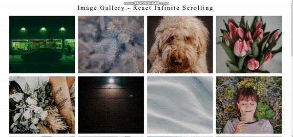

# INFINITE IMAGE GALLERY 🏞 :- By Unsplash API

## React, React Functional Hooks,API integration and styled-components.

### IMAGE GALLERY


### IMAGE GALLERY - GIF



### Packages Used:

1. create-react-app
2. axios
3. styled-components
4. react-infinite-scroll-component
5. react-lazy-load-image-component

Get your **_Access Key_** and **_Secret Key_** from _unsplash.com_ Then paste it in the project

### Installation

```
npm install
```

### Start the application

```
npm start
```

```
If you like the work then don't forget to hit that ⭐ button to show some appreciation & love
for this project as your token of love does wonders.
```
